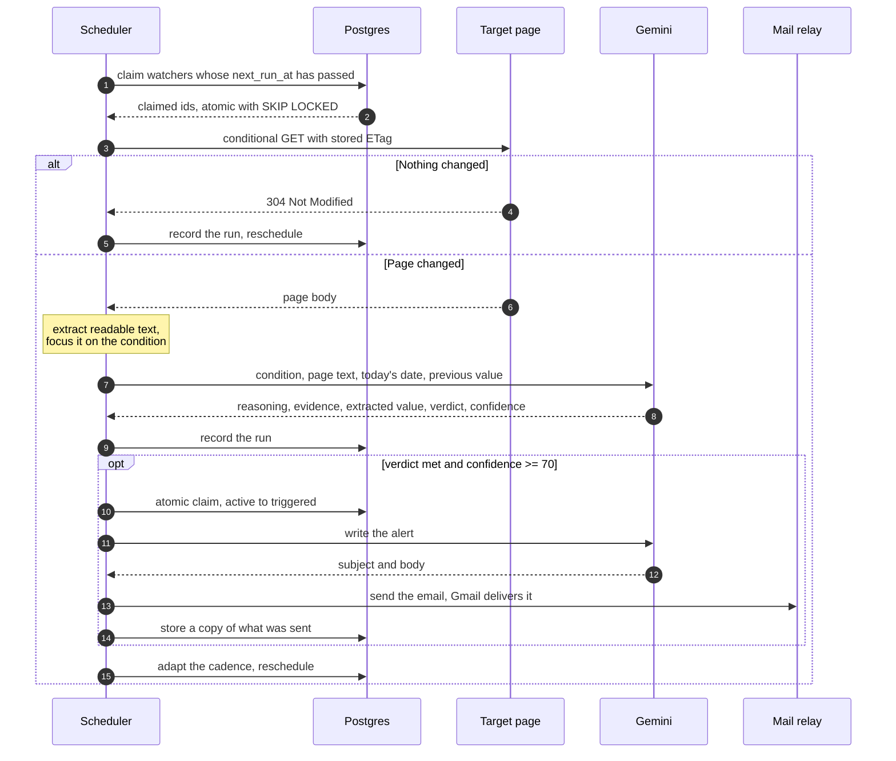

# Argus backend

The FastAPI service behind Argus. It stores the watchers, keeps their schedule,
fetches the pages, asks the AI whether the thing you were waiting for has
happened, and sends the email when it has.

**Live:** https://argus-xv4m.onrender.com

The React client is in [`../frontend`](../frontend). The project overview,
screenshots and the full system prompts are in the
[root README](../README.md).

**Stack:** Python 3.12, FastAPI, SQLAlchemy 2, Postgres, Google Gemini with a
Groq fallback, SMTP.

---

## Architecture

```mermaid
flowchart TB
    BROWSER["Browser<br/>React client"]
    MONITOR["Uptime monitor<br/>GET or HEAD /health<br/>keeps a free instance awake"]

    subgraph APP["FastAPI application"]
        direction TB
        ACCOUNTS["routers/accounts<br/>signup, login, verify, reset"]
        WATCHERS["routers/watchers<br/>create, list, edit, control"]
        AUTHMOD["auth<br/>PBKDF2 hashing, HMAC tokens"]
        SCHED["scheduler<br/>every 60s: anything due?"]
        TICK["tick<br/>the check cycle"]
        FETCH["fetcher<br/>robots.txt, throttle, SSRF guard"]
        LLM["llm<br/>provider fallback, JSON output"]
        NOTIFY["notify and mailer<br/>HTML email"]
    end

    DB[("Postgres")]
    SITES["Target websites"]
    MODELS["Gemini, then Groq"]
    MAIL["Apps Script relay,<br/>then Gmail"]

    BROWSER -- "Bearer token" --> ACCOUNTS
    BROWSER -- "Bearer token" --> WATCHERS
    MONITOR -- "keeps the process awake" --> APP

    ACCOUNTS --> AUTHMOD
    WATCHERS --> TICK
    SCHED --> TICK
    TICK --> FETCH
    TICK --> LLM
    TICK --> NOTIFY

    ACCOUNTS --> DB
    WATCHERS --> DB
    TICK --> DB
    FETCH --> SITES
    LLM --> MODELS
    NOTIFY --> MAIL
```



| Module | Lines | Responsibility |
|---|---:|---|
| `tick.py` | 675 | Check cycle, trigger rules, adaptive schedule, alerts |
| `routers/watchers.py` | 564 | Watcher endpoints, ownership rules, caps |
| `fetcher.py` | 491 | robots.txt, throttling, SSRF guards, text extraction |
| `email_templates.py` | 451 | HTML emails for alerts and account mail |
| `mailer.py` | 259 | Transport chain: Apps Script relay, Brevo, SMTP |
| `routers/accounts.py` | 353 | Signup, signin, verification, password reset |
| `demo.py` | 319 | Starter watchers, first account, demo target page |
| `prompts.py` | 271 | The three system prompts and their JSON schemas |
| `main.py` | 272 | App wiring, `/`, `/health`, `/stats`, `/tick` |
| `models.py` | 207 | Six SQLAlchemy tables |
| `auth.py` | 171 | Password hashing and signed tokens |
| `llm.py` | 159 | Provider fallback, JSON-shaped output, budget |
| `scheduler.py` | 119 | The loop that keeps Argus's own time |

---

## The check cycle

The scheduler runs inside the process, so no external cron is needed. It only
needs the process to be awake.



**Trigger rules.** An alert is sent only when the verdict is true *and*
confidence is at least 70. The trigger is an atomic
`UPDATE ... WHERE status='active'`, so a concurrent pass updates zero rows and
stays quiet, which is what prevents duplicate alerts. A normal watcher then
stands down; a repeating one re-arms and remembers the value it just reported so
the same movement cannot fire twice.

**Adaptive cadence.** A page that changed tightens toward `base / 2`; a page
unchanged for three passes relaxes toward `base * 4`, always clamped between 15
minutes and 24 hours. The ordered cadence is stored separately, so editing it
re-anchors the range.

**Failure notices.** After three consecutive failures the owner is emailed once
to say the page has stopped being readable. The counter resets on the next good
pass.

---

## The three AI roles

Three separate roles, each with its own system prompt, JSON schema and model.
They never share a conversation. The prompts live in
[`app/prompts.py`](app/prompts.py) and are printed in full in the
[root README](../README.md).

| Role | Runs | Job |
|---|---|---|
| **Commissioner** | Once, at creation | Turn plain English into a structured watcher: URL, condition, value to track, cadence, whether it repeats. Refuses anything that is not a watch order. |
| **Watcher** | Every check | Read the page and decide whether the condition is true, with reasoning, evidence, an extracted value and a confidence score. |
| **Herald** | Only on a trigger | Write the alert email. A deterministic template stands in if the model call fails. |

Field order in the Watcher schema is part of the logic, not formatting.
Structured output is generated in order, so `reasoning` is declared before `met`:
asking for the verdict first produced answers that contradicted their own
explanation.

`complete_json()` in [`app/llm.py`](app/llm.py) escalates through providers so a
busy one does not stop the watchers:

```
gemini-3.6-flash / 3.5-flash-lite  ->  gemini-flash-latest  ->  llama-3.3-70b (Groq)
```

Every run records which provider and model answered.

---

## Fetching pages politely

Argus polls the same page repeatedly, which is the traffic pattern most likely to
get a client blocked. [`app/fetcher.py`](app/fetcher.py) is built around that,
and [`tests/test_politeness.py`](tests/test_politeness.py) locks it in.

- Identifies itself honestly as `ArgusWatcher` with a contact URL.
- Reads and obeys `robots.txt`, cached for an hour, including `Crawl-delay`.
- Throttles per host, so several watchers on one site do not become a burst.
- Honours `Retry-After` on `429` and `503`, then retries once.
- Sends `ETag` and `If-Modified-Since`, so an unchanged page costs a `304`.
- Caps downloads at 1 MB while streaming, with a 15 second timeout and at most
  3 redirects.

`assert_safe_url()` refuses private, loopback, link-local and reserved ranges,
and re-checks after every redirect, so a public URL cannot bounce to an internal
address after passing the initial check. Page text is treated as untrusted
input: a page that tries to issue instructions to the model is ignored.

---

## Accounts and security

Passwords and tokens use the standard library only, so no compiled dependency is
needed to run the service.

- **Passwords**: PBKDF2-HMAC-SHA256, 240,000 rounds, per-user salt, with the
  cost stored alongside the hash so it can be raised later.
- **Tokens**: HMAC-SHA256 over a JSON payload, compared in constant time. Each
  token carries a kind, so a reset link cannot be replayed as a session.

| Token | Lifetime | Reusable |
|---|---|---|
| Session | 30 days | n/a |
| Email verification | 14 days | yes, no effect once confirmed |
| Password reset | 1 hour | no, single use |

Policies worth knowing:

- Identity comes from the token only. No client-supplied identity header is
  trusted, so one account cannot act as another.
- Signin returns the same error for a wrong password and an unknown address, and
  password reset returns the same response either way, so neither endpoint
  reveals who has an account.
- Eight consecutive failures locks an account for 15 minutes, and the lock
  expires by itself so nobody can be locked out on purpose.
- A new account works immediately for 24 hours, then needs verification. After
  that, reading still works and only creating or changing is blocked, so an
  undelivered email cannot lock someone out of their own history.
- Another account's private watcher returns `404`, not `403`, so ids cannot be
  walked to discover what exists.
- Shared watchers are readable by everyone and editable by nobody; copying one
  produces an independent watcher.
- Email subjects are flattened and every HTML value escaped, and `href` schemes
  are checked so a model-supplied `javascript:` URL cannot render as a link.
- Limits: 5 watchers per account, 25 active across the deployment.

---

## Data model

Six tables, created on startup. There is no migration tool: `create_all` plus an
idempotent list of `ALTER TABLE ... ADD COLUMN IF NOT EXISTS` statements in
[`app/db.py`](app/db.py) covers a schema this size.

| Table | Holds |
|---|---|
| `users` | Account, password hash, verification state, lockout counters |
| `watchers` | URL, condition, cadence, owner, status, HTTP validators |
| `runs` | One row per check: verdict, confidence, evidence, extracted value, provider, model, error |
| `events` | Lifecycle log, and a copy of every alert sent |
| `budget_counters` | Daily model call counts for the free-tier ceiling |
| `demo_state` | State for the demo target page |

Watchers link to their owner by email rather than a foreign key, because the
email is both the identity and the alert destination.

---

## API reference

Interactive documentation is served at `/docs` in development only. It is
switched off when `APP_ENV=production`, along with `/redoc` and
`/openapi.json`, because publishing a map of every endpoint and its request
shape to anyone who asks buys nothing. Blocking `/docs` alone would have left
the same schema readable in raw form.

### Accounts

| Method | Path | Auth | Notes |
|---|---|---|---|
| POST | `/auth/signup` | none | Creates the account, returns a session, sends the verification email |
| POST | `/auth/login` | none | Same error for a wrong password and an unknown address |
| GET | `/auth/me` | session | Account state and remaining grace |
| GET | `/auth/state` | optional | Never returns 401, so app startup can ask safely |
| POST | `/auth/verify` | none | A second use is not an error |
| POST | `/auth/resend` | session | 60 second cooldown, only mails the caller's own address |
| POST | `/auth/forgot` | none | Always the same response |
| POST | `/auth/reset` | none | Single use, and confirms the address as a side effect |

### Watchers

| Method | Path | Auth | Notes |
|---|---|---|---|
| POST | `/watchers` | verified | Returns a parsed plan, writing nothing |
| POST | `/watchers/confirm` | verified | Creates it and runs the first check in the background |
| GET | `/watchers` | session | The caller's own. `?shared=true` for shared ones |
| GET | `/watchers/{id}` | session | Own or shared |
| PATCH | `/watchers/{id}` | verified, owner | Changing page or condition clears memory and re-checks |
| POST | `/watchers/{id}/clone` | verified | Copies a shared watcher into the caller's own set |
| GET | `/watchers/{id}/runs` | session | Check history, newest first |
| GET | `/watchers/{id}/transmissions` | session | Alerts this watcher has sent |
| DELETE | `/watchers/{id}/transmissions` | verified, owner | Clears stored alerts |
| POST | `/watchers/{id}/run-now` | verified, owner | Extra check, does not shift the schedule |
| POST | `/watchers/{id}/pause` | verified, owner | |
| POST | `/watchers/{id}/resume` | verified, owner | Re-arms a watcher that has fired |
| DELETE | `/watchers/{id}` | verified, owner | Deletes the watcher and its history |

Creation is two steps so the parsed plan can be corrected before anything is
stored.

### Service

| Method | Path | Auth | Notes |
|---|---|---|---|
| GET, HEAD | `/` | none | What this service is, and where the app lives. Exists so the bare domain answers instead of returning 404, which also lets an uptime monitor point at it truthfully |
| GET, HEAD | `/health` | none | Liveness plus a real database round trip |
| GET | `/stats` | optional | Counts, plus a `mine` block when signed in |
| POST | `/pulse` | none | Presence beacon, wakes a sleeping instance |
| POST | `/tick` | `X-Tick-Secret` | Manual or external trigger for a scheduler pass |
| GET | `/logo.png` | none | Brand mark |
| GET | `/demo/target` | none | A labelled demonstration page |

`POST /tick` claims due watchers inside the request and processes them after the
response is sent, so an external caller is not held for model latency.

---

## Configuration

All settings are declared in [`app/config.py`](app/config.py) and read from the
environment. Copy [`.env.example`](.env.example) to `.env` for local
development. `.env` is gitignored.

**Required**

| Variable | Purpose |
|---|---|
| `DATABASE_URL` | Postgres URI, including `?sslmode=require` |
| `SECRET_KEY` | Signs sessions and reset links. Blank generates a random value per boot, so tokens do not survive a restart rather than being signed with a guessable key |
| `FRONTEND_BASE_URL` | Where emailed verification and reset links point, meaning the frontend rather than this API |
| `ALLOWED_ORIGIN` | CORS origins, comma separated |
| `GEMINI_API_KEY` | Primary model provider |
| `SMTP_HOST` / `_PORT` / `_USER` / `_PASSWORD` | Outgoing mail |
| `TICK_SECRET` | Shared secret for `POST /tick` |

**Optional, with defaults**

| Variable | Default | Purpose |
|---|---|---|
| `GROQ_API_KEY` | blank | Fallback provider, strongly recommended |
| `SCHEDULER_ENABLED` | `true` | Run the internal scheduler |
| `SCHEDULER_INTERVAL_SECONDS` | `60` | How often it looks for due watchers |
| `LLM_DAILY_BUDGET` | `200` | Gemini calls per day before falling back |
| `MAX_ACTIVE_WATCHERS` | `25` | Deployment-wide cap |
| `MAX_WATCHERS_PER_USER` | `5` | Per-account cap |
| `MAX_RUNS_PER_TICK` | `5` | Watchers processed per pass |
| `VERIFY_GRACE_HOURS` | `24` | How long a new account works unverified |
| `SESSION_DAYS` | `30` | Session lifetime |
| `RESET_TOKEN_HOURS` | `1` | Password reset link lifetime |
| `FULL_RECHECK_HOURS` | `6` | Force a full re-read even when unchanged |
| `CRAWL_DELAY_SECONDS` | `2` | Minimum gap between requests to one host |
| `RESPECT_ROBOTS` | `true` | Obey robots.txt |
| `SEED_ACCOUNT_EMAIL` / `_PASSWORD` | blank | Creates one account on first boot. Only ever creates, never changes an existing password |
| `OWNER_EMAIL` | blank | Last-resort alert recipient |
| `PUBLIC_BASE_URL` | localhost | This service's public URL, used in the user agent |
| `DEMO_MODE` | `true` | Seed the shared starter watchers |
| `APP_ENV` | `development` | Reported by `/health` |

Model choices (`GEMINI_MODEL_COMMISSIONER`, `GEMINI_MODEL_WATCHER`,
`GEMINI_MODEL_HERALD`, `GEMINI_MODEL_BACKUP`, `GROQ_MODEL`), `SMTP_FROM_NAME`,
`USER_AGENT`, `MAX_CRAWL_DELAY_SECONDS`, `DEMO_CYCLE_MINUTES` and the optional
`WHATSAPP_PHONE` / `WHATSAPP_APIKEY` pair can also be overridden. See
[`.env.example`](.env.example).

---

## Running it locally

Requires Python 3.11 or newer and a Postgres database.

**1. Install**

```bash
cd backend

python -m venv venv
venv\Scripts\activate                 # Windows
# source venv/bin/activate            # macOS or Linux

pip install -r requirements.txt
```

**2. Configure**

```bash
copy .env.example .env                # Windows
# cp .env.example .env                # macOS or Linux
```

Fill in `DATABASE_URL`, `GEMINI_API_KEY`, the `SMTP_*` values, and a signing
key. Generate one with:

```bash
python -c "import secrets; print(secrets.token_urlsafe(48))"
```

Setting `SEED_ACCOUNT_EMAIL` and `SEED_ACCOUNT_PASSWORD` creates one account on
first boot, which saves signing up before you can use the API.

**3. Run**

```bash
uvicorn app.main:app --reload --port 8000
```

Tables are created automatically. Confirm it is up:

```bash
curl http://127.0.0.1:8000/health
# {"status":"ok","service":"argus","env":"development","db":true}
```

The scheduler runs locally too, so watchers fire on their own. To force a pass
immediately rather than waiting for the next minute:

```bash
curl -X POST http://127.0.0.1:8000/tick -H "X-Tick-Secret: <TICK_SECRET>"
```

Interactive API documentation is at `http://127.0.0.1:8000/docs`, available
because `APP_ENV` is `development` locally. It is disabled in production.

---

## Tests

```bash
pip install -r requirements-dev.txt
pytest
```

85 tests, needing no network, no API keys and no database. They cover password
hashing and forged tokens, robots.txt and throttling, SSRF ranges and redirect
re-validation, long-page text extraction, the adaptive cadence policy, HTML
email escaping, SMTP header injection, and provider fallback.

Checks that need real credentials, such as live model verdicts and email
delivery, are run manually.

---

## Deploying

Any host that runs a long-lived Python process, or the included `Dockerfile`.
Not a serverless runtime: the scheduler lives in the process and a check takes
several seconds.

**Check the host's outbound SMTP policy before choosing one.** Providers
commonly block ports 25, 465 and 587 to stop their address ranges being used
for spam, and a blocked port does not refuse the connection, it swallows it, so
mail simply never arrives and nothing in the logs says why. Render's free tier
blocks all three; Koyeb blocks 25 and recommends 587. Set `SMTP_PORT` to a port
the host actually permits.

Where SMTP is unavailable, set `BREVO_API_KEY` and mail goes over an HTTP API on
443 instead. That works anywhere, at the cost of deliverability: mail sent by a
third party claiming to be from a Gmail address fails SPF and DKIM alignment and
is more likely to be filtered as spam. Sending through the mailbox's own
provider avoids that, which is a good reason to prefer a host that permits
SMTP.

```
Build:   pip install -r requirements.txt
Start:   uvicorn app.main:app --host 0.0.0.0 --port $PORT
Health:  /health
```

Set every required variable from the configuration section. On a host that
sleeps when idle, point an uptime monitor at `/` or `/health` every 5 minutes.

Prefer a keyword monitor expecting `"status":"ok"` over a plain status check,
because `/health` returns `200` with `"degraded"` when the database is
unreachable, and a code-only check would call that healthy.

Both paths accept **GET and HEAD**. That matters: monitors commonly probe with
HEAD to save bandwidth, and FastAPI's `@app.get` registers GET alone, unlike
plain Starlette. A GET-only endpoint answers a HEAD probe with `405 Method Not
Allowed`, and the monitor reports the service as down while it is serving
traffic perfectly well. It is a confusing failure to diagnose, because the
monitor keeps recording healthy response times throughout.

If the instance is asleep when a ping lands, the ping wakes it and the scheduler
catches up on everything that fell due, because the schedule is stored in the
database rather than in memory.

To drive the schedule externally instead, set `SCHEDULER_ENABLED=false` and have
a cron service POST to `/tick` with the `X-Tick-Secret` header.

Deploy the backend first so its URL is available for the frontend build, then set
`ALLOWED_ORIGIN` and `FRONTEND_BASE_URL` to the frontend URL and redeploy.
