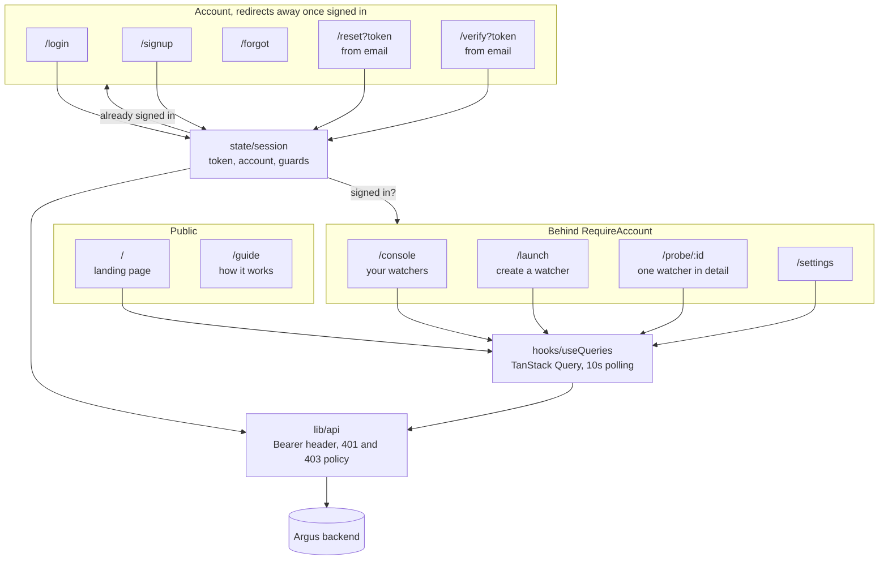

# Argus frontend

The React client for Argus. A single-page app for creating watchers, following
what they find, and managing your account.

The API it talks to is in [`../backend`](../backend). The project overview, live
URL and screenshots are in the [root README](../README.md).

**Stack:** React 19, Vite 8, React Router 7, TanStack Query 5, Tailwind CSS 4,
framer-motion. Plain JavaScript with JSX, no TypeScript. All charts and diagrams
are hand-written inline SVG, with no charting library.

---

## Architecture



### Routes

| Route | Page | Access |
|---|---|---|
| `/` | Landing, with live counts from the API | public |
| `/guide` | How it works | public |
| `/login` | Sign in | redirects to `/console` if already signed in |
| `/signup` | Create an account | redirects to `/console` if already signed in |
| `/forgot` | Request a reset link | public |
| `/reset?token=` | Choose a new password | reachable in any state, since it arrives by email |
| `/verify?token=` | Confirm an address, and the wall once the grace period ends | reachable in any state |
| `/console` | Your watchers, with tabs for found and shared | signed in |
| `/launch` | Create a watcher, in three steps | signed in |
| `/probe/:id` | One watcher: history, chart, alerts, settings | signed in |
| `/settings` | Account, appearance, about | signed in |
| `*` | Not found | public |

`/enter` redirects to `/login`, so older links still land somewhere real.

### Source layout

| Path | Lines | Contains |
|---|---:|---|
| `pages/Console.jsx` | 767 | Dashboard: watcher cards, tabs, activity, orbit map |
| `pages/Dossier.jsx` | 703 | One watcher: dial, check history, trend, alerts, edit |
| `pages/Launch.jsx` | 572 | Three-step create flow |
| `index.css` | 479 | Design tokens, background, keyframes |
| `pages/Guide.jsx` | 343 | How it works |
| `components/OrbitMap.jsx` | 333 | The animated sky, inline SVG |
| `pages/Landing.jsx` | 309 | Marketing page |
| `components/TopBar.jsx` | 292 | Header, nav, account menu, mobile sheet |
| `components/WatchDial.jsx` | 191 | Per-watcher state dial |
| `pages/Settings.jsx` | 165 | Account and preferences |
| `components/Sparkline.jsx` | 151 | Tracked-value trend chart |
| `state/session.jsx` | 143 | Token, account state, guards, sign out |
| `lib/api.js` | 142 | Fetch wrapper, auth header, error policy |
| `lib/format.js` | 130 | Verdict labels, relative time, watcher state |
| `hooks/useQueries.js` | 107 | Query and mutation hooks |

---

## Data and session

### Server state

Every read goes through TanStack Query in
[`src/hooks/useQueries.js`](src/hooks/useQueries.js), polling every 10 seconds
so a dashboard left open stays current without a websocket.

`refetchInterval` does not fire on a hidden tab, so a backgrounded dashboard
stops polling by itself and resumes on focus. Mutations invalidate the queries
they affect rather than refetching everything.

The fleet query is keyed by account email. It is the server that decides whose
watchers to return, from the session token, but keying the cache means signing in
as someone else can never show the previous account's list from cache.

### Session

[`src/state/session.jsx`](src/state/session.jsx) holds one thing: a signed token
in `localStorage`. Everything about the account, the address, whether it is
confirmed, how much grace is left, is asked of the server, because a client that
decides its own account state can be argued out of the truth by anyone who can
open developer tools.

On boot the stored token is confirmed against `/auth/state`, which never returns
401. A token can be expired, or signed with a key that has since been rotated,
and none of that is visible from the browser. Until that answer arrives, guards
render nothing rather than redirecting, so a hard refresh does not bounce a
signed-in person to the login screen.

The API client owns the two error policies so no page has to think about them:

| Response | Meaning | What happens |
|---|---|---|
| `401` | Token missing, expired or invalid | Sign out, go to `/login?expired=1` |
| `403 verification_required` | Session is fine, grace period ended | Keep the session, go to `/verify?required=1` |

Those are genuinely different situations, and treating the second as a login
failure would throw away a perfectly good session.

**Auth transport.** A bearer token in `localStorage`, sent as
`Authorization: Bearer`. Not a cookie: the frontend and backend are on different
origins, so a cookie would need `SameSite=None; Secure` plus credentialed
requests and an exactly matching CORS origin, which is a lot of ways for auth to
work locally and fail in production. The trade-off is that `localStorage` is
readable by JavaScript, which is acceptable here because there is no HTML
injection surface: no `dangerouslySetInnerHTML` anywhere, and React escapes by
default.

---

## Design system

Tokens are the source of truth. They are declared as CSS custom properties in
[`src/index.css`](src/index.css) and exposed to Tailwind through `@theme`, so
`bg-panel` and `var(--color-panel)` are always the same colour.

| Group | Tokens |
|---|---|
| Surfaces | `void`, `panel`, `panel2`, `raised` |
| Borders | `line`, `lineb` |
| Accent | `amber`, `ambersoft` |
| Meaning | `green` found, `red` trouble, `steel` neutral |
| Text | `text`, `text2`, `label`, `muted` |
| Type | `display` Bricolage Grotesque, `sans` Plus Jakarta Sans, `mono` JetBrains Mono |

One accent colour carries the interface. Green, red and steel are reserved for
meaning, so a colour on screen always says something.

### Motion

Animation is decorative and always optional. Two preferences live in
[`src/state/prefs.jsx`](src/state/prefs.jsx) and persist locally:

- **Calm mode** stops the moving parts: the orbit map, the dial, page
  transitions. It also respects the operating system's
  `prefers-reduced-motion` setting.
- **Night sky background** toggles the starfield and glow.

The background layer uses `contain: strict`, animates only `transform` and
`opacity`, promotes a single element rather than each star, halves the star count
on phones, and pauses entirely when the tab is hidden.

The page transition overlay in
[`src/components/RouteLoader.jsx`](src/components/RouteLoader.jsx) has no
artificial minimum. It counts only queries that have no data yet, so a
navigation whose data is already cached shows nothing at all, and a background
refresh of a page you are already looking at cannot make a loading spinner
appear over it.

### Writing

Plain language throughout, in the words someone would use themselves: "not yet"
rather than "condition not met", "couldn't read the page" rather than an error
code. Em dashes are avoided in all user-facing text and email.

---

## Mobile

Not a scaled-down desktop. The rule applied throughout is that a phone keeps
what someone came to do and drops what merely tells them about things.

- Statistic cards, the orbit map and the activity panel are desktop only. On a
  phone they cost two screens of scrolling before the watchers themselves.
- Watcher cards drop the cadence, the status chips and the redundant "Details"
  button, since tapping the card already opens it.
- Grid tracks use `minmax(0, 1fr)` rather than `1fr`. A grid or flex item
  defaults to `min-width: auto` and refuses to shrink below its content, which
  is what lets a long line push a whole page sideways.
- Form inputs are 16px on phones. Below that, iOS Safari zooms the page on focus
  and does not zoom back out.
- Auth pages use `min-h-dvh`, not `min-h-screen`, so the submit button is not
  hidden behind the browser's address bar.
- The header collapses into a sheet, with sign out at the bottom, past a divider,
  away from the destinations above it.

---

## Running it locally

Requires Node 20 or newer, and the backend running.

**1. Install**

```bash
cd frontend
npm install
```

**2. Configure**

```bash
copy .env.example .env.local          # Windows
# cp .env.example .env.local          # macOS or Linux
```

| Variable | Purpose |
|---|---|
| `VITE_API_URL` | Base URL of the backend, no trailing slash |
| `VITE_REPO_URL` | Optional. When set, Settings shows a source code link |

Vite only exposes variables prefixed `VITE_`, and they are baked in at build
time, so changing one needs a rebuild.

**3. Run**

```bash
npm run dev          # http://localhost:5173
```

Open **localhost**, not `127.0.0.1`. They are different origins to the browser,
and the backend's `ALLOWED_ORIGIN` has to match whichever you use.

```bash
npm run build        # production bundle into dist/
npm run preview      # serve the built bundle locally
```

---

## Deploying

Any static host. On Vercel:

| Setting | Value |
|---|---|
| Root directory | `frontend` |
| Build command | `npm run build` |
| Output directory | `dist` |
| Environment | `VITE_API_URL`, pointing at the deployed backend |

[`vercel.json`](vercel.json) rewrites every path to `index.html`, which is what
makes a deep link such as `/probe/7` resolve instead of 404ing, and what lets an
emailed `/verify?token=...` link work.

Two things have to agree on the backend, or the app will load and then fail every
request:

- `ALLOWED_ORIGIN` must include the deployed frontend origin. Preview
  deployments get their own hostnames, and the value is comma separated.
- `FRONTEND_BASE_URL` must be the deployed frontend, since that is where the
  verification and password reset links in emails point.
